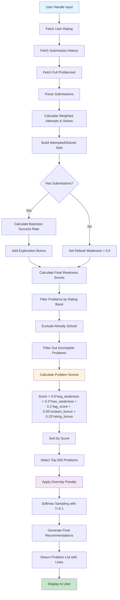

# CF Assistant

A randomized and adaptive codeforces problem recommendation system that helps competitive programmers discover problems tailored to their skill level and interests.

## Recommendation Algorithm Explained

### 1. Data Collection

For a given user `handle`, the system fetches:

- User rating
- Submission history
- Full problemset with tags

### 2. Submission Parsing

The submission history is processed to build the following statistics:

- `attempted_tags`: weighted attempts per tag
- `solved_tags`: weighted successful solves per tag
- `attempted_problems`: set of all attempted problems
- `solved_problems`: set of all solved problems

#### Weighting Mechanism

Each submission is weighted based on problem difficulty relative to the user's rating:

```
w = exp((problem_rating - user_rating) / (user_rating - 300))
```

- Harder problems contribute more weight
- Easier problems contribute less weight

This helps the system learn more from difficult attempts than from trivial ones.

### 3. Tag Weakness Estimation

After parsing submissions, the system estimates how weak the user is in each tag.

#### 3.1 Bayesian Smoothing

For each tag, a smoothed success probability is computed:

```
success = (solved + k * p) / (attempted + k)
```

Where:
- `p = 0.5`
- `k = 20 / sqrt(total_attempts + 1)`

This prevents unstable scores for tags with very few attempts.

#### 3.2 Exploration Term

To avoid overfitting to only frequently attempted tags, an exploration bonus is added:

```
exploration = c * sqrt(log(total_attempts + 1) / (attempted + 1))
```

Where:
- `c = 0.1`

This gives a boost to tags that have been explored less.

#### 3.3 Final Weakness Score

The final weakness score for each tag is:

```
weakness = (1 - success) + exploration
```

- Higher value means the user is weaker in that tag
- The values are normalized to [0, 1]

#### Cold Start Handling

If the user has no submission history, all tags are assigned a default weakness:

```
weakness[tag] = 0.5
```

This ensures new users still get balanced recommendations.

### 4. Candidate Filtering

The system considers only problems in a rating band around the user's rating:

- From `rating - 200` to `rating + 200`
- Rounded to the nearest 100

Problems are excluded if:
- They are already solved
- They are missing important metadata
- They have no tags

This keeps recommendations relevant and useful.

### 5. Problem Scoring

Each remaining problem is assigned a score based on several factors.

#### 5.1 Average Weakness

The average weakness of all tags in the problem:
- Encourages problems that train the user's weaker areas

#### 5.2 Maximum Weakness

The maximum weakness among the problem's tags:
- Helps surface problems that target a particularly weak topic

#### 5.3 Tag Diversity

Problems with more tags are slightly preferred because they often provide broader practice:

```
tag_score = log(sqrt(num_tags) + 1)
```

#### 5.4 Unseen Bonus

Problems that the user has never attempted get a small bonus:

```
unseen_bonus = 1 if problem_key not in attempted_problems else 0
```

#### 5.5 Rating Proximity

Problems closer to the user's rating get a higher score:

```
rating_bonus = exp(-(diff^2) / (2 * 300^2))
```

Where:
- `diff = problem_rating - user_rating`

If the problem is below the user's rating, the bonus is slightly reduced to prefer stronger practice.

#### Final Scoring Formula

The final score is a weighted combination of all features:

```
score =
  0.5 * avg_weakness +
  0.2 * max_weakness +
  0.1 * tag_score +
  0.05 * unseen_bonus +
  0.15 * rating_bonus
```

### 6. Candidate Selection

After scoring, the system selects the final recommendations in two stages.

#### 6.1 Pre-Selection

- All candidate problems are sorted by score
- The top 500 problems are kept for the next stage

#### 6.2 Diversity Penalty

To avoid recommending too many similar problems, the system applies a penalty based on tag overlap with already selected problems:

```
penalty = sum(log(1 + common_tags))
```

This discourages repeated recommendations from the same narrow topic area.

#### 6.3 Softmax Sampling

Instead of choosing only the top-scoring problem every time, the system samples problems probabilistically:

```
P(i) = exp(score_i / T) / sum(exp(score_j / T))
```

Where:
- `T = 0.1`

This allows the recommender to balance:
- **Exploitation**: choosing strong recommendations
- **Exploration**: keeping some variety in the output

A low temperature makes the sampling more focused on high-score candidates.

### 7. Final Output

Each recommended problem includes:

- Contest ID
- Problem index
- Problem name
- Rating
- Tags
- Score
- Direct link to the problem

### 8. Design Goals

This algorithm is designed to achieve the following:

- **Personalization**: recommendations depend on the user's own history
- **Weakness targeting**: weak tags are prioritized
- **Difficulty alignment**: problems stay close to the user's rating
- **Exploration vs exploitation**: strong matches are chosen, but variety is preserved
- **Diversity**: repeated tag patterns are reduced

### 9. Algorithm Flowchart



## Project Structure

```
cf-assistant/
├── backend/                 # Python FastAPI backend
│   ├── main.py             # Application entry point
│   ├── api.py              # Codeforces API integration
│   ├── user.py             # User-related routes and logic
│   ├── recommender.py      # Problem recommendation engine
│   ├── requirements.txt    # Python dependencies
│   └── venv/               # Virtual environment
│
└── frontend/               # React TypeScript frontend
    ├── src/
    │   ├── App.tsx         # Main application component
    │   ├── main.tsx        # React entry point
    │   ├── index.css       # Global styles
    │   ├── pages/
    │   │   └── Problems.tsx # Problems display page
    │   ├── components/     # Reusable React components
    │   └── constants/
    │       └── config.ts   # Configuration constants
    ├── package.json        # Node.js dependencies
    ├── vite.config.ts      # Vite build configuration
    └── tsconfig.json       # TypeScript configuration
```

## Technology Stack

### Backend
- **Framework**: FastAPI 0.135.1
- **Server**: Uvicorn 0.41.0
- **HTTP Client**: Requests 2.32.5
- **Language**: Python 3

### Frontend
- **Library**: React 19.2.0
- **Language**: TypeScript 5.9.3
- **Build Tool**: Vite 7.3.1
- **Styling**: Tailwind CSS 4.2.1

## Getting Started

### Prerequisites

- Python 3.8+
- Node.js 16+
- npm or yarn

### Configuration

Make config file at [frontend/src/constants/config.ts](frontend/src/constants/config.ts) and paste the following code

```typescript
export const USER_HANDLE = "your_user_name";
export const API_BASE_URL = "http://127.0.0.1:8000";

export type Problem = {
  contestId: number
  index: string
  name: string
  rating: number
  tags: string[]
  score: number
  link: string
}
```

### Backend Setup

1. Navigate to the backend directory:
   ```bash
   cd backend
   ```

2. Create and activate a virtual environment:
   ```bash
   python3 -m venv venv
   source venv/bin/activate  # On Windows: venv\Scripts\activate
   ```

3. Install dependencies:
   ```bash
   pip install -r requirements.txt
   ```

4. Run the development server:
   ```bash
   python main.py
   ```
   The API will be available at `http://127.0.0.1:8000`

### Frontend Setup

1. Navigate to the frontend directory:
   ```bash
   cd frontend
   ```

2. Install dependencies:
   ```bash
   npm install
   ```

3. Run the development server:
   ```bash
   npm run dev
   ```
   The application will be available at `http://localhost:5173` (or another port shown in terminal)

## API Endpoints

- `GET /user/problems/{handle}` - Get recommended problems for a use

## Future Improvements

Possible improvements to this algorithm include:

- **Time-decay** for old submissions
- **Spaced repetition** for weak topics
- **Global tag difficulty normalization**
- **Adaptive sampling temperature**
- **Better handling of new users with no history**

## License

This project is open source and available under the MIT License.

## Support

For issues or questions, please open an issue on the project repository.
